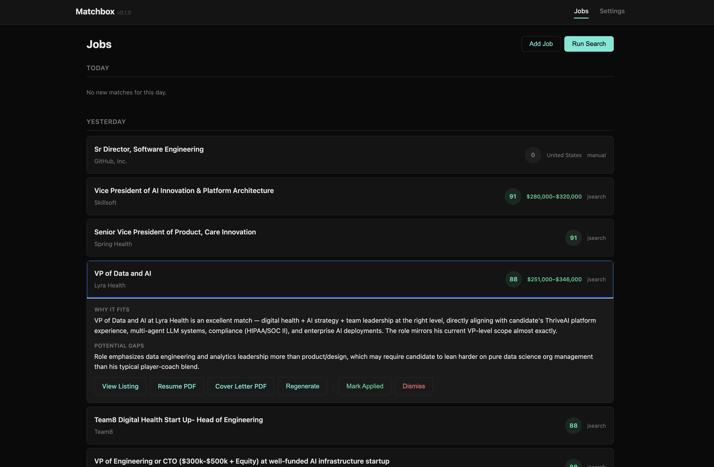

# Matchbox

AI-powered job search agent that finds roles, matches them to your profile, and prepares tailored applications.



## What it does

- **Multi-source search** — Remotive, JSearch (LinkedIn/Indeed/Glassdoor), Greenhouse boards, Lever boards, company career pages, HN Who is Hiring, YC Jobs
- **AI scoring** — every job is evaluated against your profile and target roles using Claude
- **Tailored applications** — generates customized resumes and cover letters for top matches
- **Web dashboard** — browse, manage, and prepare applications with a clean UI
- **CLI mode** — batch processing for automated daily runs
- **Company targeting** — add companies by name and Matchbox finds where they list jobs

## Quick start

### Prerequisites

- Python 3.12+
- Node.js 22+ (for frontend build)
- [uv](https://docs.astral.sh/uv/) package manager
- An [Anthropic API key](https://console.anthropic.com/)

### Setup

No setup files are required — configure everything through the web UI on first launch. Or to pre-configure:

```bash
cp data/config.yaml.example data/config.yaml   # edit with your API keys and profile
cp data/RESUME.example.md data/RESUME.md       # paste your resume in markdown
```

### Run the web app

```bash
uv sync
cd web && npm install && npm run build && cd ..
uv run matchbox-web
```

Open [http://localhost:8000](http://localhost:8000)

### Run the CLI

```bash
uv run matchbox
```

### Docker

```bash
docker compose up --build
```

All user data (config, resume, database, generated PDFs) lives in the `data/` directory — shared between Docker and the CLI.

## Configuration

All configuration lives in `data/config.yaml`:

- **API keys** — Anthropic (required), RapidAPI (optional, enables JSearch)
- **Profile** — your professional background, used for matching and cover letters
- **Target roles** — description of what you're looking for
- **Search queries** — keywords to search across job boards
- **Target companies** — Greenhouse/Lever board tokens and career page URLs
- **Sources** — toggle which job boards to search
- **Prompts** — customize how the AI scores jobs, tailors resumes, and writes cover letters
- **PDF CSS** — custom styling for generated resume and cover letter PDFs

API keys can also be set via environment variables (`ANTHROPIC_API_KEY`, `RAPIDAPI_KEY`) or `.env` file.

## Architecture

- **Backend:** Python / FastAPI (`job_search/`)
- **Frontend:** SvelteKit 5 (`web/`)
- **Data:** all user files live in `data/` (config, resume, database, output)
- **Database:** SQLite (auto-created as `data/jobs.db`)
- **AI:** Anthropic Claude via LangChain for scoring, tailoring, and extraction
- **PDF:** WeasyPrint for resume and cover letter generation

## License

MIT
