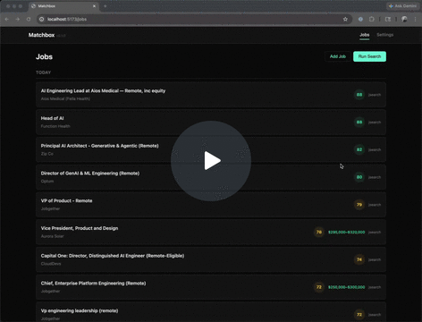
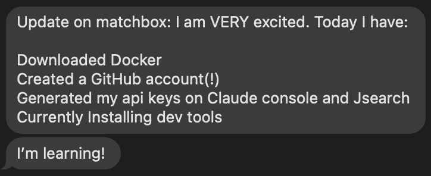

# Matchbox

AI-powered job search agent that finds roles, matches them to your profile, and prepares tailored applications.


## Get started

The fastest way to get running is with Docker — no Python or Node.js required:

```bash
git clone https://github.com/marcammann/matchbox.git
cd matchbox
docker compose up --build
```

Open [http://localhost:8000](http://localhost:8000), go to **Settings**, paste your API keys and resume, and run your first search.

New to the command line? The [Quickstart guide](QUICKSTART.md) walks you through every step, including installing Docker and getting API keys.

## Demo

<a href="https://www.loom.com/share/3a07a4e65bb14f04aafaee837661d005">
  
</a>

## Philosophy

Matchbox is a personal tool, not a platform. Clone the repo, point it at your resume and API keys, and run it yourself. The codebase is intentionally small and straightforward so you can open it in [Claude Code](https://docs.anthropic.com/en/docs/claude-code) and reshape it to fit your search — add job sources, tweak scoring prompts, change the UI, whatever you need.

You don't need to be a developer to use it. One early user — with no prior engineering experience — went from zero to a working Docker setup in an afternoon, learning Git, API keys, and Docker along the way.



## What it does

- **Multi-source search** — Remotive, JSearch (LinkedIn/Indeed/Glassdoor), Greenhouse, Lever, Ashby boards, company career pages, HN Who is Hiring, YC Jobs
- **AI scoring** — every job is evaluated against your profile and target roles using Claude
- **Tailored applications** — generates customized resumes and cover letters for top matches
- **Web dashboard** — browse, manage, and prepare applications with a clean UI
- **Company targeting** — add companies by name or URL and Matchbox auto-detects their ATS (Greenhouse, Lever, Ashby)
- **Remote In Tech browser** — browse 800+ remote-friendly companies, filter by tech stack, match against your resume, and add them as targets
- **Smart career page scraping** — auto-detects ATS URLs on career pages and uses the API directly; warns when pages require JavaScript rendering
- **CLI mode** — batch processing for automated daily runs

## Running without Docker

### Prerequisites

- Python 3.12+
- Node.js 22+ (for frontend build)
- [uv](https://docs.astral.sh/uv/) package manager
- An [Anthropic API key](https://console.anthropic.com/)
- A [RapidAPI key](https://rapidapi.com/letscrape-6bRBa3QguO5/api/jsearch) (strongly recommended — enables JSearch for LinkedIn/Indeed/Glassdoor results)

### Web app

```bash
uv sync
cd web && npm install && npm run build && cd ..
uv run matchbox-web
```

Open [http://localhost:8000](http://localhost:8000)

### CLI

```bash
uv run matchbox
```

## Configuration

All configuration lives in `data/config.yaml` or can be set through the web UI:

- **API keys** — Anthropic (required), RapidAPI (optional, enables JSearch)
- **Profile** — your professional background, used for matching and cover letters
- **Target roles** — description of what you're looking for
- **Search queries** — keywords to search across job boards
- **Target companies** — Greenhouse/Lever/Ashby board tokens and career page URLs
- **Sources** — toggle which job boards to search
- **Prompts** — customize how the AI scores jobs, tailors resumes, and writes cover letters
- **PDF CSS** — custom styling for generated resume and cover letter PDFs

API keys can also be set via environment variables (`ANTHROPIC_API_KEY`, `RAPIDAPI_KEY`) or `.env` file.

To pre-configure without the UI:

```bash
cp data/config.yaml.default data/config.yaml   # edit with your API keys and profile
cp data/RESUME.example.md data/RESUME.md       # paste your resume in markdown
```

All user data (config, resume, database, generated PDFs) lives in the `data/` directory.

## Architecture

- **Backend:** Python / FastAPI (`matchbox/`)
- **Frontend:** SvelteKit 5 (`web/`)
- **Data:** all user files live in `data/` (config, resume, database, output)
- **Database:** SQLite (auto-created as `data/jobs.db`)
- **AI:** Anthropic Claude via LangChain for scoring, tailoring, and extraction
- **PDF:** WeasyPrint for resume and cover letter generation

## Why this isn't production-ready

Matchbox was sketched out quickly as a personal tool — it's a throwaway sketch. The value is in learning what components you need, not in the code itself. If you were building this for real, you'd toss it out and start over cleanly. Here's a taste of what would need to change:

- **No auth or multi-tenancy.** Adding proper authentication (SSO, OAuth) is a significant effort on its own, and SSO providers add cost and complexity.
- **Fragile long-running processes.** API calls kick off background tasks that can silently fail. In production, these should be modeled as durable workflows with retries, state tracking, and proper error recovery.
- **Manual API key management.** Users have to bring their own Anthropic and RapidAPI keys. A real product would absorb AI costs and handle billing (Stripe, usage metering, etc.). Something like OpenRouter could simplify model access with a single key, but that still requires key management infrastructure. Keeping this BYO-key means zero additional cost to try it.
- **Limited job board coverage.** The search relies on heuristics across a handful of ATS platforms (Greenhouse, Lever, Ashby) and job aggregators. A production system would need integrations with all major ATS providers and a proper service to identify where each company posts jobs. Many companies only list jobs on their own sites behind JavaScript-heavy pages — Netflix is a good example — which would require per-company scraping workflows with browser automation.
- Lots more, but this is just a starting point.

## License

MIT
